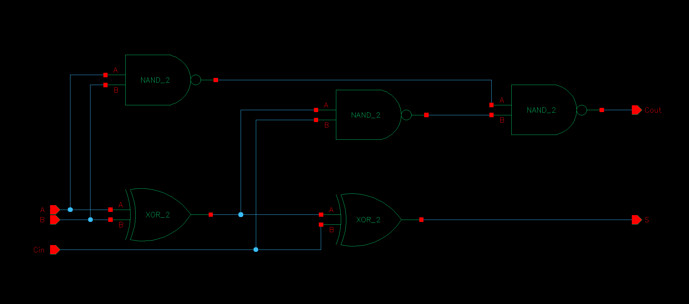
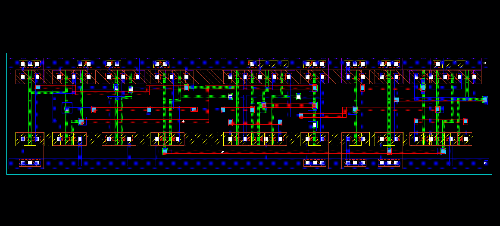
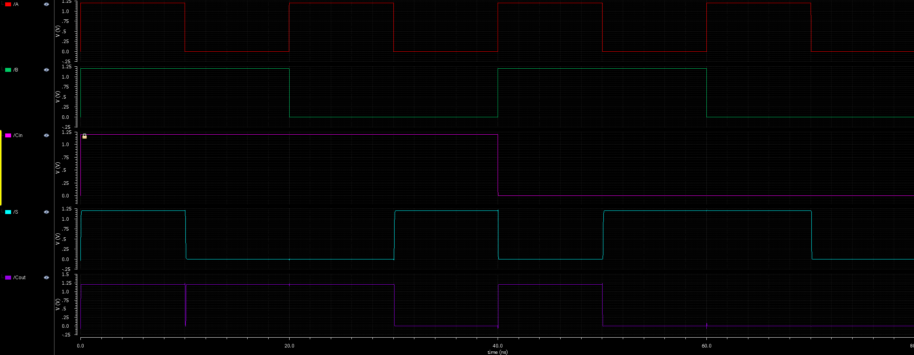

# CMOS-Full-Adder-Layout-gpdk090
This repository contains the schematic design, transistor sizing, physical layout, transient verification, and DRC reports for a **CMOS Full Adder Standard Cell** implemented using Cadence Virtuoso on Generic PDK 90nm (GPDK090).

---

## 1. Specifications & Architecture
- **Process Technology:** Generic PDK 90nm (GPDK090)
- **Supply Voltage ($V_{DD}$):** 1.2 V
- **Cell Architecture:** 28-Transistor CMOS Topology (2 × XOR2 + 3 × NAND2)
- **Logic Functions:**
  - **Sum ($S$):** $A \oplus B \oplus C_{in}$
  - **Carry Out ($C_{out}$):** $(A \cdot B) + (C_{in} \cdot (A \oplus B))$
- **Sizing Strategy:** Symmetrical standard cell track height with optimized PMOS/NMOS aspect ratios ($W/L$) for equal rise/fall propagation delays.

---

## 2. Schematic & Physical Layout

### Transistor-Level Schematic

### Clean Standard Cell Layout

---

## 3. Functional Verification & Waveform Analysis

Transient simulation was performed across all 8 input combinations ($2^3 = 8$) to verify the functional integrity of the adder cell.

### Truth Table Verification Summary
| Time Interval | $A$ | $B$ | $C_{in}$ | Sum ($S$) | Carry ($C_{out}$) | Verification Status |
| :---: | :---: | :---: | :---: | :---: | :---: | :---: |
| **0 – 10 ns** | 1 | 1 | 1 | **1** | **1** | Passed |
| **10 – 20 ns** | 0 | 1 | 1 | **0** | **1** | Passed |
| **20 – 30 ns** | 1 | 0 | 1 | **0** | **1** | Passed |
| **30 – 40 ns** | 0 | 0 | 1 | **1** | **0** | Passed |
| **40 – 50 ns** | 1 | 1 | 0 | **0** | **1** | Passed |
| **50 – 60 ns** | 0 | 1 | 0 | **1** | **0** | Passed |
| **60 – 70 ns** | 1 | 0 | 0 | **1** | **0** | Passed |
| **70 – 80 ns** | 0 | 0 | 0 | **0** | **0** | Passed |

---

## 4. Physical Verification (DRC / LVS)
- **Design Rule Checking (DRC):** Verified with Assura DRC. Clean with **0 errors**.
- **Layout Versus Schematic (LVS):** Layout netlist matches schematic topology with 0 net/terminal discrepancies.
- **DRC Summary:** See full log details in [`full_adder_drc.sum`](full_adder_drc.sum).

---

## 5. Repository Structure & Deliverables
- [`full_adder.gds`](full_adder.gds) — Standard GDSII stream file ready for mask review.
- [`full_adder.netlist`](full_adder.netlist) — Transistor-level SPICE netlist extracted from schematic.
- [`full_adder_drc.sum`](full_adder_drc.sum) — Detailed Assura DRC execution log.
- `schematic.png` / `layout.png` / `waveform.png` — Visual design and verification assets.
